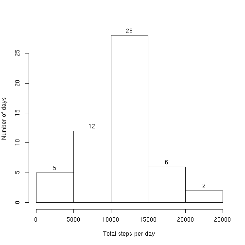

# Processing and summarizing activity monitor data

First step - read in the data. Then, look at the first few lines.


```r
activity <- read.csv("activity.csv",header=TRUE,stringsAsFactors=FALSE)
head(activity)
```

```
##   steps       date interval
## 1    NA 2012-10-01        0
## 2    NA 2012-10-01        5
## 3    NA 2012-10-01       10
## 4    NA 2012-10-01       15
## 5    NA 2012-10-01       20
## 6    NA 2012-10-01       25
```

Sum the total number of steps per day. Then, make a histogram of this information.


```r
total_steps_per_day <- aggregate(activity$steps,by=list(activity$date),FUN=sum)
hist(total_steps_per_day$x,xlab="Total steps per day",ylab="Number of days",main="",labels=TRUE)
```



Calculate the mean and median of total steps per day.


```r
mean(total_steps_per_day$x,na.rm=TRUE)
```

```
## [1] 10766.19
```

```r
median(total_steps_per_day$x,na.rm=TRUE)
```

```
## [1] 10765
```

Next, get the mean and median number of steps taken per timepoint across all the dates.


```r
mean_steps_per_timepoint <- aggregate(activity$steps,by=list(activity$interval),FUN=function(x)mean(x,na.rm=TRUE))
median_steps_per_timepoint <- aggregate(activity$steps,by=list(activity$interval),FUN=function(x)median(x,na.rm=TRUE))
```

Make a time series plot of time versus mean_steps_per_timepoint.

To do this, we need to get the 5-minute intervals from midnight (00:00) to 23:55 in date format.

Start with today's date at midnight, then add 5 minutes at a time up to 1,435 minutes in.

To help us, we use a function mns provided here: https://www.r-bloggers.com/how-to-calculate-with-dates-and-hours-in-r/.

We call today at midnight dtm and add to that. As long as the day is the same for all intervals, it will just display the time on the plot.


```r
dtm <- as.POSIXlt("2017-10-25 00:00:00")

mns <- function(m) {
 x <- m * 60
 return(x)
}

plot(dtm + mns(seq(from=0,to=1435,by=5)),mean_steps_per_timepoint$x,type="l",xlab="Time",ylab="Mean number of steps")
```


Get the interval with the maximum value for mean number of steps.


```r
mean_steps_per_timepoint[which(mean_steps_per_timepoint$x == max(mean_steps_per_timepoint$x)),]
```

```
##     Group.1        x
## 104     835 206.1698
```

Now, let's replace any NA values we find with either the mean or median value for the timepoint.

Not sure yet which is better, so let's try both and see how it affects things.

Do the NA values only occur during certain intervals on a given date, or do the dates with NAs have all NAs across the whole day?

Let's check.


```r
table(activity[which(is.na(activity$steps) == TRUE),"date"])
```

```
## 
## 2012-10-01 2012-10-08 2012-11-01 2012-11-04 2012-11-09 2012-11-10 
##        288        288        288        288        288        288 
## 2012-11-14 2012-11-30 
##        288        288
```

It looks like when a date has an NA, it has NAs across the whole day.

So, impute all steps on those days.


```r
activity_with_steps_imputed_using_mean_values <- activity
activity_with_steps_imputed_using_median_values <- activity

dates_with_missing_values <- unique(activity[which(is.na(activity$steps) == TRUE),"date"])

for(date in dates_with_missing_values)
{
activity_with_steps_imputed_using_mean_values[which(activity_with_steps_imputed_using_mean_values$date == date),"steps"] <- mean_steps_per_timepoint$x
activity_with_steps_imputed_using_median_values[which(activity_with_steps_imputed_using_median_values$date == date),"steps"] <- median_steps_per_timepoint$x
}
```

Calculate total steps per day using both of these tables.

Then remake the total steps histogram using both tables, and put them side by side as a panel plot so we can compare.


```r
total_steps_per_day_using_mean_to_impute <- aggregate(activity_with_steps_imputed_using_mean_values$steps,by=list(activity_with_steps_imputed_using_mean_values$date),FUN=sum)
total_steps_per_day_using_median_to_impute <- aggregate(activity_with_steps_imputed_using_median_values$steps,by=list(activity_with_steps_imputed_using_median_values$date),FUN=sum)

par(mfrow=c(1,2))

hist(total_steps_per_day_using_mean_to_impute$x,xlab="Total steps per day",ylab="Number of days",main="Mean used to impute",labels=TRUE)
hist(total_steps_per_day_using_median_to_impute$x,xlab="Total steps per day",ylab="Number of days",main="Median used to impute",labels=TRUE)
```


It seems like using the mean to impute makes somewhat more sense, as it results in more days with total steps per day closer to what we typically see.

Get the mean and median total steps per day using the mean per interval to impute.


```r
mean(total_steps_per_day_using_mean_to_impute$x)
```

```
## [1] 10766.19
```

```r
median(total_steps_per_day_using_mean_to_impute$x)
```

```
## [1] 10766.19
```

Now the mean and median of total steps per day are exactly equal.

Now, let's compare the mean steps per interval across weekdays versus weekends.

Use the data with missing values filled in here, so make "activity" equal to "activity_with_steps_imputed_using_mean_values".


```r
activity <- activity_with_steps_imputed_using_mean_values

days_of_the_week_per_date <- weekdays(strptime(activity$date,format="%Y-%m-%d"))

activity_weekdays <- activity[which(days_of_the_week_per_date != "Saturday" & days_of_the_week_per_date != "Sunday"),]
activity_weekends <- activity[which(days_of_the_week_per_date  == "Saturday" | days_of_the_week_per_date == "Sunday"),]

mean_steps_per_timepoint_weekdays <- aggregate(activity_weekdays$steps,by=list(activity_weekdays$interval),FUN=function(x)mean(x,na.rm=TRUE))
mean_steps_per_timepoint_weekends <- aggregate(activity_weekends$steps,by=list(activity_weekends$interval),FUN=function(x)mean(x,na.rm=TRUE))

par(mfrow=c(1,2))

plot(dtm + mns(seq(from=0,to=1435,by=5)),mean_steps_per_timepoint_weekdays$x,type="l",xlab="Time",ylab="Mean number of steps",main="Weekdays",las=2)
plot(dtm + mns(seq(from=0,to=1435,by=5)),mean_steps_per_timepoint_weekends$x,type="l",xlab="Time",ylab="Mean number of steps",main="Weekends",las=2)
```


This wasn't necessary for the plot, but also supposed to include a factor variable weekday vs. weekend in the activity data frame.
So let's do that now.


```r
weekday_vs_weekend <- rep("weekday",times=nrow(activity))
weekday_vs_weekend[which(days_of_the_week_per_date  == "Saturday" | days_of_the_week_per_date == "Sunday")] <- "weekend"

#By default, data.frame will convert weekday_vs_weekend into a factor.

activity <- data.frame(activity,Day.type = weekday_vs_weekend)
```

